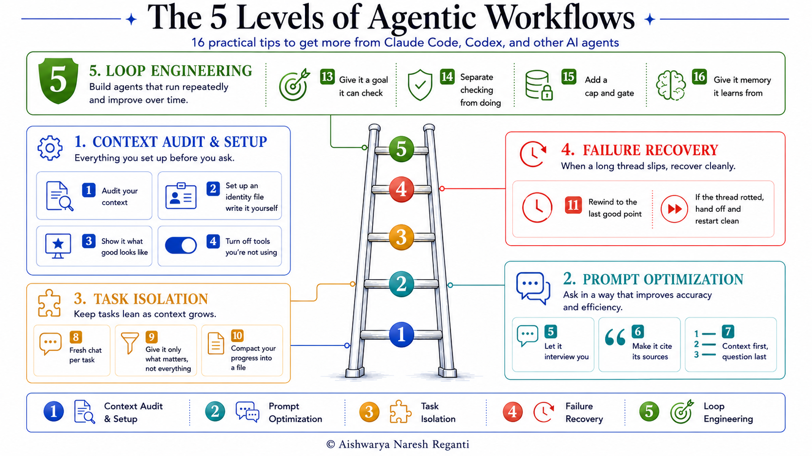

# 16 Research Backed Tips That Make Claude Code 10x Better (& Cheaper!)

[Watch on YouTube](https://www.youtube.com/@aish_reganti) · TBD



<!-- cheat sheet -->

## In this video

- **Level 1, context audit and setup**: what you put in place before asking for anything, so the agent stops guessing
- **Level 2, prompt optimization**: how to ask, including the habit that replaces most prompt-wording technique
- **Level 3, task isolation**: keeping the agent sharp through a long task instead of watching it drift
- **Level 4, failure recovery**: the 2 moves that fix a rotted thread in seconds
- **Level 5, loop engineering**: the 4 parts of a loop that runs on its own without spinning or running up a bill
- **16 tips across the 5 levels**, each with a prompt you can copy, and the research behind the ones that are counterintuitive

## The 16 tips, with prompts

Every tip from the video, with its prompt, is in one file:
**[claude-code-16-tips.md](claude-code-16-tips.md)**

Do not take notes. Paste this into your agent and it will read the whole thing and
apply it with you:

```
Read https://raw.githubusercontent.com/aishwaryanr/awesome-generative-ai-guide/main/youtube/claude-code-16-tips.md

Go through all 16 tips. Tell me which ones we already do, which ones apply to this
project, and which ones do not. For the ones that apply and we are not doing,
propose the specific change and wait for me to approve each one before you make it.
```

It covers all 5 levels: context audit and setup, prompt optimization, task
isolation, failure recovery, and loop engineering.

## Resources

- [LevelUp Labs](https://levelup-labs.ai/)
- [The Nuanced Perspective (newsletter)](https://thenuancedperspective.substack.com)
- [LevelUp Labs education](https://levelup-labs.ai/education)
- [Awesome Generative AI Guide](https://github.com/aishwaryanr/awesome-generative-ai-guide)
- [My courses on Maven](https://maven.com/aishwarya-kiriti)

## Sources

- Gloaguen et al., *"Evaluating AGENTS.md: Are Repository-Level Context Files Helpful for Coding Agents?"*, ETH Zurich and LogicStar.ai, 13 February 2026. Across 138 real Python tasks, LLM-generated context files lowered task success by roughly 2 to 3% while raising inference cost by over 20%. The cost increase held for developer-written files too, so the case for writing your own is control over what the agent does, not a free win. [arxiv.org](https://arxiv.org/abs/2602.11988)
- Chroma, *"Context Rot: How Increasing Input Tokens Impacts LLM Performance"*, July 2025, for the finding across 18 models that the same fact in a short prompt beats the same fact inside a large one. [research.trychroma.com](https://research.trychroma.com/context-rot)
- Liu et al., *"Lost in the Middle: How Language Models Use Long Contexts"*, 2023, for why position inside the context window changes what gets used. [arxiv.org](https://arxiv.org/abs/2307.03172)
- Drew Breunig, *"How Long Contexts Fail"*, June 2025, for the tool-overload result: a quantized Llama 3.1 8b failed a task on the GeoEngine benchmark with 46 tools available and passed the same task with 19, well inside its context window. [dbreunig.com](https://www.dbreunig.com/2025/06/22/how-contexts-fail-and-how-to-fix-them.html)
- Anthropic, *"Effective context engineering for AI agents"*, for the smallest-set-of-high-signal-tokens framing behind Level 3. [anthropic.com](https://www.anthropic.com/engineering/effective-context-engineering-for-ai-agents)

## Transcript

_Published transcript goes here once the video is live._
